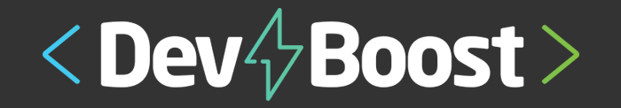

<!--
*** Thanks for checking out this README Template. If you have a suggestion that would
*** make this better, please fork the repo and create a pull request or simply open
*** an issue with the tag "enhancement".
*** Thanks again! Now go create something AMAZING! :D
***
***
***
*** To avoid retyping too much info. Do a search and replace for the following:
*** github_username, repo, twitter_handle, email
-->

<!-- PROJECT SHIELDS -->
<!--
*** I'm using markdown "reference style" links for readability.
*** Reference links are enclosed in brackets [ ] instead of parentheses ( ).
*** See the bottom of this document for the declaration of the reference variables
*** for contributors-url, forks-url, etc. This is an optional, concise syntax you may use.
*** https://www.markdownguide.org/basic-syntax/#reference-style-links
-->

[![project-version][project-version]][project-url]
[![Npm][npm-shield]][npm-url]
[![Issues][nodejs-shield]][nodejs-url]
[![LinkedIn][express-shield]][express-url]
[![MIT License][license-shield]][license-url]

<!-- PROJECT LOGO -->
<br />
<p align="center">
  <a href="#">
    
  </a>

  <h3 align="center">DevBooter - Express Module</h3>

  <p align="center">
    Application developed on express module on DevBooster course
    <br />
    <br />
    <br />
    <a href="/issues">Report Bug</a>
    ·
    <a href="/issues">Request Feature</a>
  </p>
</p>

<!-- TABLE OF CONTENTS -->

## Table of Contents

- [Table of Contents](#table-of-contents)
- [About The Project](#about-the-project)
  - [Built With](#built-with)
- [Getting Started](#getting-started)
  - [Prerequisites](#prerequisites)
  - [Installation](#installation)
- [Usage](#usage)
- [Contributing](#contributing)
- [License](#license)
- [Contact](#contact)

<!-- ABOUT THE PROJECT -->

## About The Project

Application developed on express module on DevBooster course
**To avoid retyping too much info. Do a search and replace with your text editor for the following:**

### Built With

- [NodeJS](https://nodejs.org/)
- [ExpressJS](https://expressjs.com/)

<!-- GETTING STARTED -->

## Getting Started

To get a local copy up and running follow these simple steps.

### Prerequisites

This is an example of how to list things you need to use the software and how to install them.

- npm

```sh
npm install npm@latest -g
```

### Installation

1. Clone the repo

```sh
git clone https://github.com/fernandonetom/devbooster-express.git
```

2. Install NPM packages

```sh
npm install
```

<!-- USAGE EXAMPLES -->

## Usage

```sh
npm run dev
```

<!-- CONTRIBUTING -->

## Contributing

Contributions are what make the open source community such an amazing place to be learn, inspire, and create. Any contributions you make are **greatly appreciated**.

1. Fork the Project
2. Create your Feature Branch (`git checkout -b feature/AmazingFeature`)
3. Commit your Changes (`git commit -m 'Add some AmazingFeature'`)
4. Push to the Branch (`git push origin feature/AmazingFeature`)
5. Open a Pull Request

<!-- LICENSE -->

## License

Distributed under the MIT License.

<!-- CONTACT -->

## Contact

Project Link: [DevBooster-Express][project-url]

<!-- MARKDOWN LINKS & IMAGES -->
<!-- https://www.markdownguide.org/basic-syntax/#reference-style-links -->

[project-url]: https://github.com/fernandonetom/devbooster-express
[project-version]: https://img.shields.io/github/package-json/v/fernandonetom/devbooster-express?style=flat-square
[npm-shield]: https://img.shields.io/badge/npm-6.14-red
[npm-url]: https://www.npmjs.com/
[nodejs-shield]: https://img.shields.io/badge/NodeJS-12.18-green
[nodejs-url]: https://nodejs.org/en/
[express-shield]: https://img.shields.io/badge/ExpressJS-4.17.1-blue
[express-url]: https://expressjs.com/
[license-shield]: https://img.shields.io/badge/license-MIT-yellowgreen
[license-url]: #
